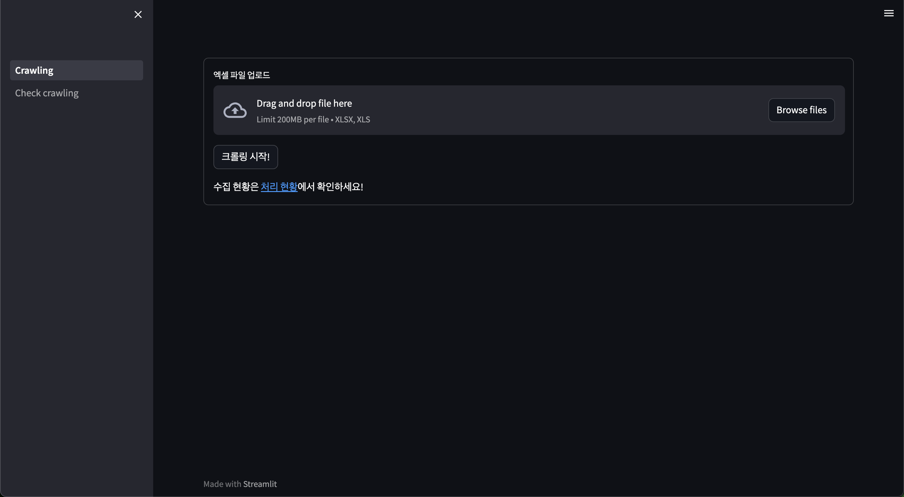
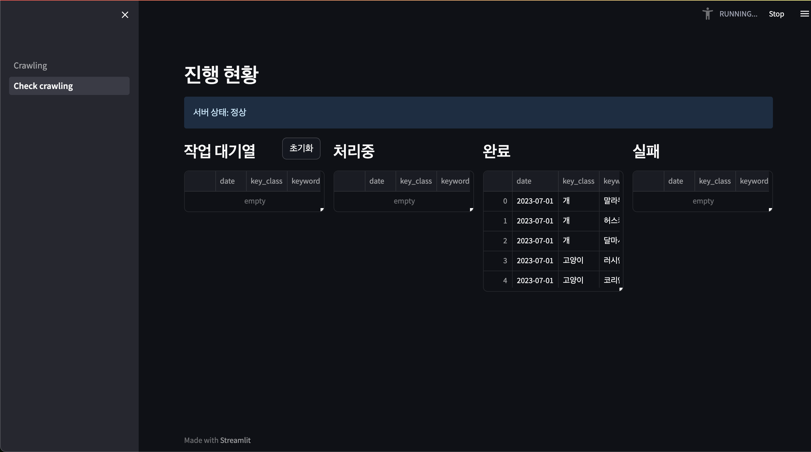

# Image Crawler

## 페이지 설명

- 메인 페이지

- 스테이터스 페이지


## Quick Start
```bash
# Please install docker, docker compose before execute 
docker compose up -d
```

## Reference
- Crawler: [https://github.com/hardikvasa/google-images-download](https://github.com/hardikvasa/google-images-download)
- Streamlit: [https://streamlit.io/](https://streamlit.io/)
- Flask: [https://flask.palletsprojects.com/en/2.3.x/](https://flask.palletsprojects.com/en/2.3.x/)
- MongoDB: [https://www.mongodb.com/](https://www.mongodb.com/)