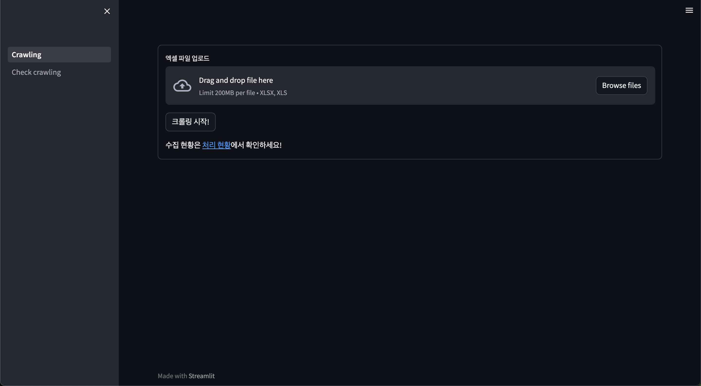
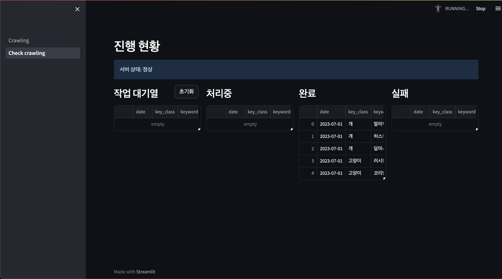

# Image Crawler

상세 분석 문서: [PROJECT_ANALYSIS.md](PROJECT_ANALYSIS.md)

## 페이지 설명

- 메인 페이지

- 스테이터스 페이지


## Quick Start
```bash
# Please install docker, docker compose before execute 
docker compose up -d
```

기본 frontend 주소: `http://localhost:3001`

### Optional Environment Variables

- `DATA_ROOT`: host path mounted to `/Data`
- `MONGO_DATA_ROOT`: host path for MongoDB persistence
- `FRONTEND_PORT`: published port for the Next.js frontend container

## Reference
- Crawler Engine: Selenium + Chromium + Bing Images
- Next.js: [https://nextjs.org/](https://nextjs.org/)
- React: [https://react.dev/](https://react.dev/)
- TypeScript: [https://www.typescriptlang.org/](https://www.typescriptlang.org/)
- Flask: [https://flask.palletsprojects.com/en/2.3.x/](https://flask.palletsprojects.com/en/2.3.x/)
- MongoDB: [https://www.mongodb.com/](https://www.mongodb.com/)
